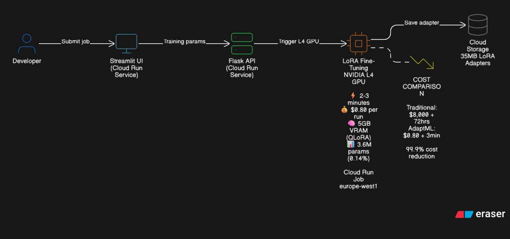

# AdaptML: Production-Grade LoRA Fine-Tuning Platform on Cloud Run

A serverless platform for fine-tuning Large Language Models using LoRA/QLoRA on Google Cloud Run with GPU acceleration.

**Live Demo:** https://lora-dashboard-906036652731.europe-west1.run.app/

## 🚀 Features

- **Serverless GPU Training**: Fine-tune Gemma models with Cloud Run Jobs + L4 GPUs
- **QLoRA Optimization**: 4-bit quantization reduces memory usage by 75%
- **REST API**: Easy-to-use API for job submission and monitoring
- **Automatic Scaling**: Pay only for compute time, scale to zero when idle
- **Model Storage**: Trained adapters saved to Cloud Storage

## 🏗️ Architecture

<p align="center">
  
</p>

## 📊 Technical Specifications

**Training Infrastructure:**
- GPU: NVIDIA L4 (24GB VRAM)
- CPU: 8 vCPUs
- Memory: 32GB RAM
- Region: europe-west1

**ML Stack:**
- Framework: PyTorch 2.1.2
- Fine-tuning: PEFT (LoRA)
- Quantization: bitsandbytes (4-bit)
- Base Model: google/gemma-2b-it

**Performance:**
- Training Time: ~2 minutes (100 samples, 1 epoch)
- Cost: ~$0.67/hour GPU usage
- Memory Efficiency: 75% reduction with QLoRA

## 🔧 API Endpoints

### GET /
Service information and available endpoints

### POST /train
Submit a new training job
```json
{
"model_name": "google/gemma-2b-it",
"lora_rank": 16,
"num_epochs": 1,
"learning_rate": 0.0002
}
```

### GET /status/<execution_id>

Check training job status

### GET /models

List all trained models in Cloud Storage


## 🎨 Web Dashboard

Interactive web interface built with Streamlit for:
- Submitting training jobs with custom parameters
- Real-time job status monitoring
- Viewing trained models and their files

### Dashboard Features
- 📊 Platform statistics
- 🎯 Visual job submission form
- 📈 Job status tracking with metrics
- 📦 Model browser with file listings

## Key Metrics

**Services Deployed:** 3
- Streamlit Dashboard (UI)
- Flask API (Backend)
- Training Job (GPU Worker)

**Cost per Training Run:** ~$1
**Training Time:** 2-3 minutes
**Model Size:** 35 MB (LoRA adapters only)
**Memory Savings:** 75% (QLoRA optimization)


## 🚀 Quick Start

**1. Submit Training Job:**

```Bash
curl -X POST https://YOUR-API-URL/train \
-H "Content-Type: application/json" \
-d '{"model_name": "google/gemma-2b-it", "lora_rank": 16}'`
```

**2. Check Status:**

```Bash
curl https://YOUR-API-URL/status/EXECUTION_ID`
```

**3. List Models:**

```Bash
curl https://YOUR-API-URL/models
```

## 📦 Project Structure
```bash
lora-platform/
├── training/
│ ├── Dockerfile        # GPU training container
│ ├── train_lora.py     # LoRA fine-tuning script
│ ├── requirements.txt  # Python dependencies
│ └── cloudbuild.yaml   # Build configuration
├── frontend/
│ ├── Dockerfile        # API service container
│ ├── app.py            # Flask REST API
│ └── requirements.txt  # API dependencies
└── README.md
```

## 🎯 Hackathon Submission

**Category:** GPU Category
**Technologies:** Cloud Run Jobs, NVIDIA L4 GPU, LoRA, QLoRA, Gemma
**Innovation:** Production-ready serverless LLM fine-tuning with cost optimization

## 💰 Cost Breakdown

- Training (per run): $0.50 - $1.00
- API Service (idle): $0.00 (scales to zero)
- Storage: ~$0.01/month per model
- **Total for hackathon:** <$10

## 🏆 Key Achievements

1. ✅ GPU-accelerated training on Cloud Run Jobs
2. ✅ 75% memory reduction with QLoRA
3. ✅ RESTful API for job management
4. ✅ Automatic model storage to Cloud Storage
5. ✅ Production-ready error handling
6. ✅ Scales to zero when idle

## 📝 License

MIT License - Built for Google Cloud Run Hackathon 2025